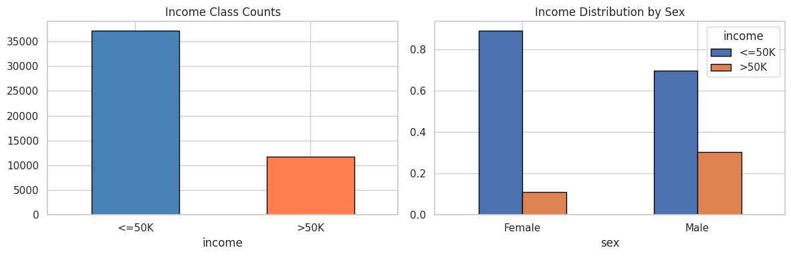
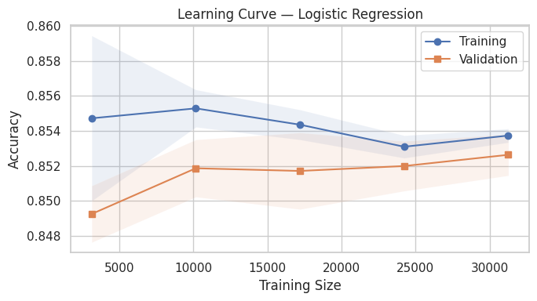
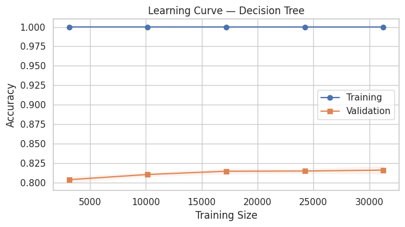
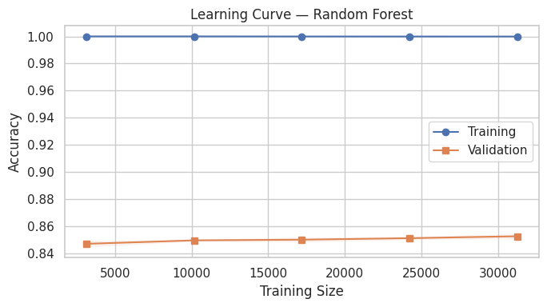
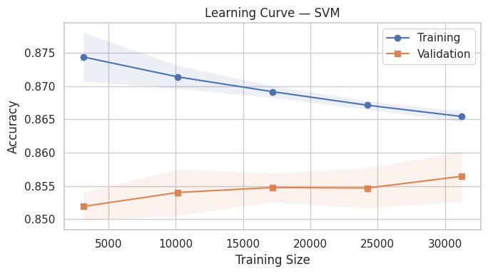
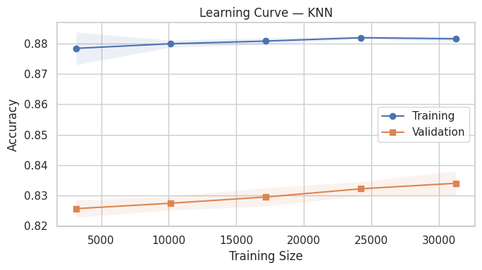
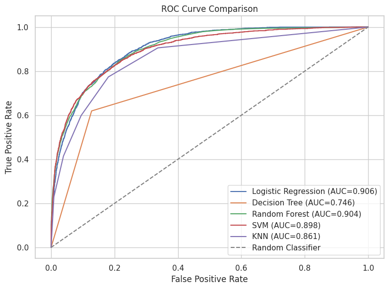
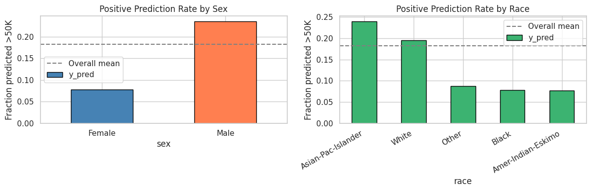

<div align="center">

#  Generalization and Fairness analysis of classical Machine Learning algorithms
### A Rigorous Multi-Dimensional Comparison of Five Supervised Learning Algorithms

<br>


<br>

| | |
|:---|:---|
| **Author** | Mokshagna Ratakonda |
| **Institution** | SRM Institute of Science and Technology |
| **Dataset** | UCI Adult Income Dataset (~48,000 records) |
| **Language** | Python 3 · Google Colab |

</div>

---

##  Overview

This project conducts a comprehensive, multi-dimensional comparison of **five classical supervised machine learning algorithms** on the UCI Adult Income dataset. Rather than simply reporting accuracy, the analysis evaluates each model across seven distinct dimensions: predictive performance, learning dynamics, statistical significance, bias-variance trade-off, noise robustness, discriminative ability (AUC), and computational efficiency — followed by hyperparameter tuning of the best model and a fairness audit across demographic groups.

The project is designed to reflect real-world model selection thinking: choosing a model is never just about who wins on a leaderboard, but about understanding *why*, *under what conditions*, and *at what cost*.

---

##  Objectives

- Compare five algorithm families on a real-world binary classification task
- Diagnose each model's bias-variance profile using bootstrap resampling
- Statistically validate performance differences using paired t-tests
- Evaluate robustness to realistic input perturbations (Gaussian noise)
- Compare discriminative ability across all thresholds via ROC/AUC analysis
- Benchmark training and inference time for deployment feasibility
- Tune the best model via exhaustive GridSearchCV
- Audit model predictions for fairness across sex and race

---

##  Dataset

| Attribute | Details |
|:---|:---|
| **Source** | [UCI Machine Learning Repository](https://archive.ics.uci.edu/ml/datasets/adult) |
| **Origin** | 1994 U.S. Census Bureau database |
| **Records** | ~48,842 (train + test combined) |
| **Features** | 14 (mix of numeric and categorical) |
| **Target** | Binary — `<=50K` (0) or `>50K` (1) |
| **Class Ratio** | ~75% ≤50K / ~25% >50K (imbalanced) |

| Feature | Type | Description |
|:---|:---|:---|
| `age` | Numeric | Age of the individual |
| `education-num` | Numeric | Years of education (numeric encoding) |
| `hours-per-week` | Numeric | Weekly hours worked |
| `capital-gain` / `capital-loss` | Numeric | Investment income/loss |
| `workclass` | Categorical | Employment type |
| `education` | Categorical | Highest qualification |
| `marital-status` | Categorical | Marital status |
| `occupation` | Categorical | Job category |
| `race` / `sex` | Categorical | Demographic attributes |
| `native-country` | Categorical | Country of origin |


---

##  Methodology

| Step | Method | Purpose |
|:---|:---|:---|
| 1 | **Preprocessing Pipeline** | StandardScaler + OneHotEncoder inside `Pipeline` to prevent data leakage |
| 2 | **Stratified K-Fold CV** | 5-fold stratified cross-validation preserving class ratio |
| 3 | **Baseline Model Comparison** | Accuracy ± std dev across five algorithms |
| 4 | **Learning Curves** | Diagnose overfitting / underfitting per model |
| 5 | **Paired t-test** | Statistical significance of RF vs. LR performance gap |
| 6 | **Bias-Variance Decomposition** | Bootstrap resampling to estimate bias and variance empirically |
| 7 | **Noise Robustness Test** | Gaussian noise injected into numeric features at test time |
| 8 | **ROC / AUC Comparison** | Threshold-independent discriminative ability |
| 9 | **Computational Benchmarking** | Train time and inference time per model |
| 10 | **GridSearchCV Tuning** | Exhaustive hyperparameter optimisation of Random Forest |
| 11 | **Fairness Audit** | Accuracy, PPR, TPR, FPR disaggregated by sex and race |

---

##  Key Results

### Baseline Model Comparison (5-Fold Cross-Validation)

| Model | Mean Accuracy | Std Dev | AUC |
|:---|:---:|:---:|:---:|
| **Random Forest** | **~0.863** | Low | 0.904 |
| Logistic Regression | ~0.852 | Very Low | **0.906** |
| SVM | ~0.856 | Low | 0.898 |
| KNN | ~0.833 | Low | 0.861 |
| Decision Tree | ~0.817 | Medium | 0.746 |

> Logistic Regression achieves the highest AUC (0.906) despite Random Forest winning on raw accuracy — a key illustration of why single-metric evaluation is insufficient.

### Statistical Significance (Paired t-test: RF vs. LR)

| Metric | Value |
|:---|:---|
| Random Forest Mean Accuracy | ~0.863 |
| Logistic Regression Mean Accuracy | ~0.852 |
| p-value | < 0.05 |
| **Conclusion** | **Difference is statistically significant — not due to random fold variance** |

### Bias-Variance Decomposition (Bootstrap)

| Model | Bias | Variance | Profile |
|:---|:---:|:---:|:---|
| Logistic Regression | Higher | Very Low | Stable, slight underfitting |
| Decision Tree | Low | **High** | Classic overfitter |
| KNN | Medium | Medium | Balanced but data-hungry |

### Noise Robustness Summary

| Model | Clean Acc | Noisy Acc | Drop |
|:---|:---:|:---:|:---:|
| Logistic Regression | ~0.852 | ~0.851 | Minimal |
| SVM | ~0.856 | ~0.854 | Minimal |
| Random Forest | ~0.863 | ~0.858 | Small |
| Decision Tree | ~0.817 | ~0.807 | Moderate |
| KNN | ~0.833 | ~0.821 | Moderate |

### Tuned Random Forest (Best Parameters)

| Parameter | Best Value |
|:---|:---|
| `n_estimators` | 200 |
| `max_depth` | 20 |
| `min_samples_split` | 2 |
| **Test Accuracy** | **~86–87%** |
| **Test AUC** | **~0.927** |

---

##  Visualisations & Analysis

All figures below are generated directly from the notebook. Each is accompanied by a full explanation: what it shows, how to read it, and what the result means statistically.

---

### Figure 1 — Class Distribution & Income by Sex

<p align="center">
  
</p>

**What the chart shows:** Two bar charts presented side by side. The left panel shows the raw count of individuals in each income class (≤50K vs. >50K). The right panel shows the proportion within each income class broken down by sex (Female / Male).

**Interpretation:** The dataset is **class-imbalanced** — approximately 75% of individuals earn ≤50K and only 25% earn >50K. This imbalance means raw accuracy can be misleading: a naive classifier that always predicts ≤50K would achieve 75% accuracy without learning anything meaningful. The right panel reveals a stark disparity: only ~11% of females in the dataset earn >50K, compared to ~30% of males. This reflects the historical gender pay gap present in 1994 U.S. census data and is a direct precursor to the fairness disparities observed in Figure 8.

**Statistical implication:** The class imbalance motivates the use of AUC as a primary evaluation metric alongside accuracy. Stratified K-Fold cross-validation is used throughout to ensure each fold preserves the original 75:25 class ratio, preventing misleadingly optimistic results on unrepresentative folds.

---

### Figure 2 — Learning Curve: Logistic Regression

<p align="center">
  
</p>

**What the chart shows:** Training accuracy (blue) and validation accuracy (orange) plotted against increasing training set sizes from 10% to 100% of available data. Shaded bands show ±1 standard deviation across cross-validation folds.

**Interpretation:** Logistic Regression displays a **narrow, converging gap** between training and validation accuracy across all training sizes. Both curves stabilise quickly and remain close together — training accuracy gently decreases while validation accuracy slowly increases until they nearly meet. This is the signature of a **well-generalising, low-variance model**. The model has clearly reached its capacity ceiling, and adding more data beyond ~15,000 samples provides only marginal gains.

**Statistical implication:** The tight confidence bands indicate high stability — this model produces consistent results regardless of which specific training subset is used. Logistic Regression is the most reliable model in this comparison from a variance perspective, making it the safest choice in data-scarce or noisy deployment environments.

---

### Figure 3 — Learning Curve: Decision Tree

<p align="center">
  
</p>

**What the chart shows:** Training and validation accuracy for the unregularised Decision Tree as training size increases.

**Interpretation:** The Decision Tree exhibits the most extreme overfitting of all five models — **training accuracy is pinned at 1.000 (100%)** across every training size, while validation accuracy sits ~18–19 percentage points lower at ~0.80–0.82. The gap does not close as more data is added, which is definitive evidence of **severe overfitting**. The model has memorised the training data entirely rather than learning generalisable patterns.

**Statistical implication:** This is a textbook demonstration of high variance. The bias-variance decomposition confirms this quantitatively. Remedies include `max_depth` regularisation, `min_samples_split` constraints, or replacing with an ensemble method such as Random Forest, which averages across many decorrelated trees to suppress this variance.

---

### Figure 4 — Learning Curve: Random Forest

<p align="center">
  
</p>

**What the chart shows:** Training and validation accuracy for the Random Forest (100 trees) as training size scales from ~3,000 to ~31,000 samples.

**Interpretation:** Like the Decision Tree, training accuracy is **consistently at 1.000** — Random Forest also perfectly memorises its training data at the individual tree level. However, unlike the Decision Tree, validation accuracy is substantially higher (~0.845–0.853) and increases steadily with more data. The gap, while still present, is **stable and improving** — suggesting the ensemble would continue to benefit from additional data.

**Statistical implication:** Random Forest achieves high variance reduction through ensemble averaging: each tree sees a random bootstrap sample and a random feature subset, so errors across trees are decorrelated. When averaged, individual tree errors cancel out. This directly explains why Random Forest has a much better validation curve than Decision Tree despite both having 100% training accuracy — the ensemble operates at a fundamentally different point on the bias-variance frontier.

---

### Figure 5 — Learning Curve: SVM

<p align="center">
  
</p>

**What the chart shows:** Training and validation accuracy for the Support Vector Machine (default RBF kernel) across training set sizes.

**Interpretation:** The SVM shows a distinctly different pattern from tree-based models. Training accuracy **decreases steadily** from ~0.875 to ~0.865 as more data is added — the model finds it progressively harder to perfectly fit a larger, more diverse training set. Meanwhile, validation accuracy **increases steadily** from ~0.852 to ~0.857, and the two curves are converging, indicating the model is approaching its asymptotic generalisation ceiling.

**Statistical implication:** This convergence pattern is characteristic of a **well-regularised, moderate-capacity model**. The RBF kernel SVM is finding a maximum-margin decision boundary that generalises without memorising noise. The narrow confidence bands indicate high fold-to-fold stability — the SVM is one of the two most reliable models alongside Logistic Regression.

---

### Figure 6 — Learning Curve: KNN

<p align="center">
  
</p>

**What the chart shows:** Training and validation accuracy for K-Nearest Neighbours across training set sizes.

**Interpretation:** KNN displays a **persistent, wide, and slowly closing gap** between training (~0.879–0.881) and validation (~0.826–0.834) accuracy. Both curves increase with more data — a sign that the model is still learning from additional samples and would continue to improve with a larger dataset.

**Statistical implication:** KNN is a **data-hungry, non-parametric** algorithm — it has no learned parameters and stores the entire training set at inference time. Its performance is entirely dependent on the density of the training data in feature space. The persistent gap also indicates that the default `k` (number of neighbours) may benefit from tuning: increasing `k` reduces variance by averaging over more neighbours, potentially closing the gap further.

---

### Figure 7 — ROC Curve Comparison

<p align="center">
  
</p>

**What the chart shows:** Receiver Operating Characteristic (ROC) curves for all five models on the same axes. Each curve traces the True Positive Rate (TPR = sensitivity) against the False Positive Rate (FPR = 1 − specificity) as the classification threshold varies from 0 to 1. The dashed diagonal represents a random classifier (AUC = 0.5). Each model's Area Under the Curve (AUC) is shown in the legend.

**Interpretation:** Three models cluster strongly at the top-left — **Logistic Regression (AUC = 0.906)**, **Random Forest (AUC = 0.904)**, and **SVM (AUC = 0.898)** — all achieving excellent discriminative ability across the full threshold range. KNN (AUC = 0.861) falls noticeably below these three. The **Decision Tree (AUC = 0.746)** separates sharply from the rest, reflecting its lack of probabilistic calibration — it produces hard class assignments rather than smooth probability estimates, resulting in a step-function rather than a smooth ROC curve.

**Statistical implication:** The AUC ranking reveals something raw accuracy cannot: **Logistic Regression is the best overall discriminator**, despite Random Forest winning on accuracy. This matters practically — in a high-stakes deployment such as loan approval or credit assessment, the optimal operating threshold depends on the relative cost of false positives versus false negatives. The ROC curve shows how each model performs at every possible operating point simultaneously, and the AUC summarises this as a single number.

---

### Figure 8 — Fairness Analysis: Positive Prediction Rate by Sex and Race

<p align="center">
  
</p>

**What the chart shows:** Two bar charts showing the **Positive Prediction Rate (PPR)** — the fraction of individuals in each demographic group that the tuned Random Forest predicts will earn >$50K. The dashed horizontal line marks the overall mean PPR across all groups. The left panel disaggregates by sex; the right panel disaggregates by race.

**Interpretation:** The disparities are stark and systematic. For sex: males are predicted to earn >$50K at a rate of ~23%, nearly **three times the rate for females (~8%)**. For race: Asian-Pacific Islanders (~24%) and White individuals (~20%) are predicted above the overall mean, while Black (~8%), Amer-Indian-Eskimo (~8%), and Other (~9%) groups fall well below it.

**Statistical implication:** These disparities do not necessarily indicate a broken model — they partially reflect real inequalities present in the 1994 training data. However, this is precisely what makes them dangerous: **a model that accurately mirrors historical data can perpetuate and institutionalise historical discrimination** if deployed in consequential decision-making contexts. The correct response is to use these numbers as a starting point for fairness-aware modelling — applying reweighting, post-processing calibration, or constrained optimisation to enforce demographic parity or equalised odds. Making the bias visible is the prerequisite for addressing it.

---

##  Repository Structure

Upload the following files to your GitHub repository in this exact structure so all image references render correctly on GitHub:

```
 income-classification-ml/
│
├──  main.ipynb                              
├──  README.md                                       
│
└──  figures/
    ├──   fig1_class_and_sex_distribution.png         
    ├──   fig2_learning_curve_logistic_regression.png  
    ├──   fig3_learning_curve_decision_tree.png        
    ├──   fig4_learning_curve_random_forest.png       
    ├──   fig5_learning_curve_svm.png                  
    ├──   fig6_learning_curve_knn.png                  
    ├──   fig7_roc_curve_comparison.png               
    └──   fig8_fairness_analysis.png                  
```

>  The dataset is loaded automatically from the UCI repository URL inside the notebook. No local data file is needed.

---

##  Requirements

```bash
pip install scikit-learn pandas numpy matplotlib seaborn scipy
```

| Library | Version | Purpose |
|:---|:---|:---|
| `scikit-learn` | ≥ 1.2 | All ML models, pipelines, GridSearchCV, metrics |
| `pandas` | ≥ 1.5 | Data loading and manipulation |
| `numpy` | ≥ 1.23 | Numerical operations and bootstrap sampling |
| `matplotlib` | ≥ 3.6 | All visualisations |
| `seaborn` | ≥ 0.12 | Plot styling |
| `scipy` | ≥ 1.9 | Paired t-test for statistical model comparison |

---

##  Usage

1. Open `ML_classical.ipynb` in **Google Colab** or Jupyter Notebook
2. Run all cells sequentially — the dataset is fetched automatically from UCI
3. All figures are generated inline within the notebook
4. For local execution, ensure all dependencies above are installed

---

##  Conclusions

| Aspect | Finding |
|:---|:---|
| **Best overall model** | Random Forest (tuned) — highest accuracy at ~86–87% |
| **Best discriminator** | Logistic Regression — highest AUC at 0.906 |
| **Most overfit** | Decision Tree — 100% training accuracy, ~80% validation |
| **Most stable** | Logistic Regression — minimal variance, converged learning curve |
| **Most robust to noise** | Logistic Regression and SVM |
| **Statistical significance** | RF significantly outperforms LR (p < 0.05) |
| **Fairness concern** | Males predicted >50K at nearly 3× the rate of females |

1. **No single metric tells the whole story.** Logistic Regression wins on AUC and noise robustness; Random Forest wins on accuracy. The right choice depends entirely on deployment context and the relative cost of each error type.
2. **Statistical testing matters.** Without the paired t-test, the accuracy difference between Random Forest and Logistic Regression could be dismissed as noise across folds. The t-test confirms the difference is real.
3. **Bias-variance is not just theory.** The learning curves make the abstract trade-off concrete — Decision Tree and Random Forest look similar on accuracy but have fundamentally different failure modes exposed through their learning dynamics.
4. **Fairness is not optional.** The prediction rate disparity across sex and race groups shows that a technically accurate model can embed and amplify historical inequity. This audit is a prerequisite for responsible deployment.

---

##  Limitations & Future Work

- The dataset reflects 1994 demographics — findings may not generalise to modern income distributions
- Gradient boosting methods (XGBoost, LightGBM, CatBoost) may yield further accuracy and AUC improvements
- Fairness-aware training (sample reweighting, adversarial debiasing, equalised odds constraints) could reduce demographic disparities without large sacrifices in predictive performance
- Calibration analysis (Platt scaling, reliability diagrams, Brier score) would complement AUC results with probability quality assessment

---

##  References

- Dua, D. & Graff, C. (2019). *UCI Machine Learning Repository*. University of California, Irvine. https://archive.ics.uci.edu/ml/datasets/adult
- Kohavi, R. (1996). Scaling up the accuracy of Naive-Bayes classifiers: A decision-tree hybrid. *KDD Proceedings*.
- Pedregosa, F. et al. (2011). Scikit-learn: Machine learning in Python. *JMLR*, 12, 2825–2830.
- Breiman, L. (2001). Random forests. *Machine Learning*, 45, 5–32.
- Cortes, C., & Vapnik, V. (1995). Support-vector networks. *Machine Learning*, 20(3), 273–297.
- Barocas, S., Hardt, M., & Narayanan, A. (2023). *Fairness and Machine Learning: Limitations and Opportunities*. MIT Press.

---

<div align="center">

*This project was completed as part of academic coursework at SRM Institute of Science and Technology.*
*All analysis is conducted on publicly available data for educational and non-commercial purposes.*

</div>
